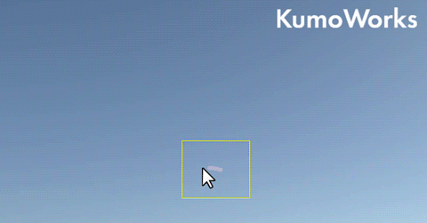

# KumoWorks

## What is KumoWorks?
KumoWorks is a cloud rendering tool for animation production.

The software is based on a cloud rendering engine developed by Tomohiro Suzuki.

## How to Use
1. Launch KumoWorks.
1. Draw a silhouette of cloud on the viewer.
1. Hit Enter(Return) key.

More detailed instruction is to be prepared later.

### Configuration Files Location
Configuration INI files (such as presets and default settings) will be saved in the following folders:
- On Windows: `C:/Users/USER_NAME/AppData/Local/KumoWorks/`
- On macOS: `/Users/USER_NAME/Library/Preferences/KumoWorks/`
- On Linux: `/home/USER_NAME/.config/`

## How to Build Locally
- [On Windows](./misc/how_to_build_win.md) 
- [On macOS](./misc/how_to_build_macos.md)
- [On Linux](./misc/how_to_build_linux.md)

## Licensing
[Modified BSD license](./LICENSE.txt).

## Acknowledgement
The software had been developed receiving helpful advices and feedback from Takumi Tanji, an animation background artist / art director.
